# 개요
보통 컴퓨터 관련 학부에서 배우는 정렬 알고리즘은 내부 정렬이다. 정렬하고자 하는 모든 원소들을 메인 메모리에 올려놓고 정렬을 수행하는 것이다. $O(n^2)$에 해당하는 버블소트, 선택정렬, 삽입정렬 등과 $O(n \log n)$에 해당하는 퀵소트[\[1\]](#fn-1), 머지소트, 힙소트 등등.

외부 정렬은 정렬하고자 하는 원소들이 너무 많아서 한 번에 모두 메인 메모리에 올려놓을 수 없는 상황에 사용한다(메인 메모리에 올릴 수 없으니 HDD, SSD 같은 **보조기억장치**에 저장된 상태). 메인 메모리가 `1GB`, 정렬해야 할 데이터가 `128GB`인 상황을 생각해 보자.

이 상황에서 전체 데이터를 잘 정렬할 수 있을까? 할 수 있다면, 가장 효율적인 방법은 무엇일까.

> ## 효율적?
> 보조기억장치의 경우 조작이 자유롭지 못하며 읽고 쓰는 속도가 주기억장치(메인 메모리)에 비해 심각하게 느리다.
> 따라서, 외부 정렬은 보조기억장치에 접근하는 횟수가 적을 수록 효율적이라고 한다.

# 열쇠는 머지소트에
가장 효율적인 방법은 무엇이냐는 위 질문에 대한 정답은 바로 머지소트 기반의 외부 정렬이다. 지금부터 머지소트를 어떻게 적용하여 외부 정렬을 수행하는지 설명한다. 이해를 돕기 위해 위에서 제시한 상황에 대해 설명할 것이다.

## 설명
1. 먼저 메인 메모리에 올릴 수 있는 1GB만큼씩 데이터를 가져와서 내부 정렬을 수행한다. 여기서 내부 정렬은 $O(1)$ 크기의 추가 메모리를 사용하면서 평균적으로 빠르게 동작하는 퀵소트를 쓰면 좋을 것이다.

    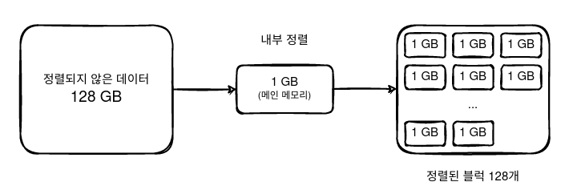

2. 이제 우리는 정렬된 1GB의 블럭 128개를 얻었다. 결과적으로 우리는 이 모든 블럭을 잘 병합하여 전체적으로 정렬된 상태를 원한다. 이를 위해 먼저 2개의 블럭을 선택하고 머지소트에서 사용되는 아이디어를 이용해 병합을 실시한다.

    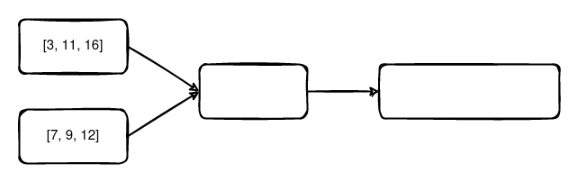

    각 1GB 블럭을 병합하는 과정을 그림으로 확인해 보자.

    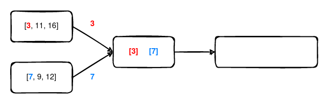

    처음에 각 블럭에서 1개씩 메인 메모리로 가져와서 비교한다.

    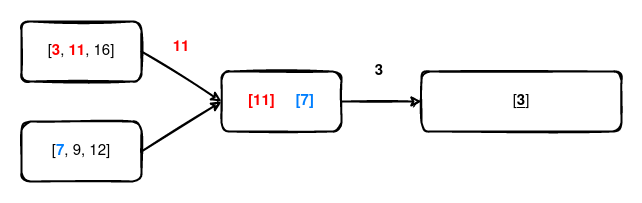

    3이 더 작기 때문에 보조기억장치에 3을 기록하고, 3을 가져왔던 위쪽 블럭에서 11을 가져온다.

    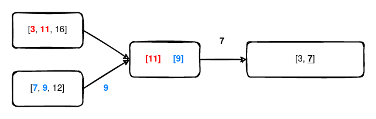

    7이 더 작기 때문에 보조기억장치에 7을 기록하고, 7을 가져왔던 아래쪽 블럭에서 9를 가져온다.

    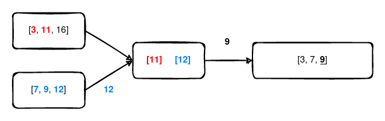

    9가 더 작기 때문에 보조기억장치에 9를 기록하고, 9를 가져왔던 아래쪽 블럭에서 12를 가져온다.

    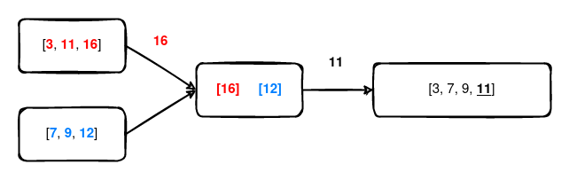

    11이 더 작기 때문에 보조기억장치에 11을 기록하고, 11를 가져왔던 위쪽 블럭에서 16를 가져온다.

    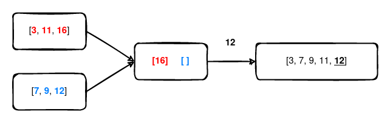

    12가 더 작기 때문에 보조기억장치에 12를 기록하고, 아래쪽 블럭은 더 이상 읽을 데이터가 없기 때문에 그대로 둔다.

    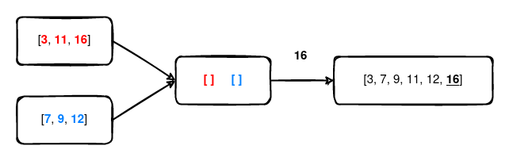

    16밖에 남지 않았으므로 보조기억장치에 16을 기록하고, 두 블럭 모두 더 이상 읽을 데이터가 없으므로 병합을 종료한다. 이 과정을 나머지 126개의 블럭에 대해서도 모두 수행한다.

3. 이제 우리는 정렬된 2GB의 블럭 64개를 얻는다. 이러한 방식으로 병합을 진행하면 블럭의 크기는 2배씩 커지고, 블럭의 수는 2배씩 줄어들어 정렬된 128GB의 블럭 1개가 남게 된다.

## 시간복잡도 분석
외부 정렬은 보조기억장치에 접근하는 횟수가 적을 수록 좋은 것이라고 위에서 설명했다. 여기서 보조기억장치에 저장된 전체 데이터를 읽고 쓰는 것을 `pass`라고 한다.

위 설명의 1번 과정에서 1GB만큼씩 데이터를 가져와서 정렬된 1GB의 블럭 128개를 만들었는데, 이 과정이 1번의 pass이다. 이후 2GB, 4GB, 8GB, 16GB, 32GB, 64GB, 128GB로 병합하는 데 각각 1번의 pass가 걸렸으므로 총 8번의 pass로 정렬을 완료한 것이다.

이를 일반화하면 다음과 같다. 메인 메모리의 크기를 $M$, 정렬해야 할 데이터의 크기를 $N$이라고 하자. $M$ 크기만큼 데이터를 읽어와서 내부 정렬을 수행하면 정렬된 $\lceil\frac{N}{M}\rceil$ 개의 블럭을 얻는다. 1번의 pass에 블럭의 수는 2배씩 줄어들므로 모두 병합하는 데 $\lceil\log_2\lceil\frac{N}{M}\rceil\rceil$ 번의 pass가 필요하다.

빅오표기법으로 나타내면 그냥 $O(\log(\frac{N}{M}))$이다.

## 더 알아보기
위에서 설명한 방식은 2-way merge 알고리즘이다. 일반화 버전인 [K-way merge 알고리즘](https://en.wikipedia.org/wiki/K-way_merge_algorithm)도 존재한다. K-way merge 알고리즘을 사용하면 단순히 계산해 봤을 때 $O(\log_K(\frac{N}{M}))$이므로 K가 커질수록 더 좋을 것이라 생각할 수도 있겠다.

하지만 세상은 그렇게 호락호락하지 않다. HDD 같은 자기디스크의 경우 보통 데이터를 찾는 데 걸리는 시간(seek time)은 10ms, 데이터를 전송하는 속도는 100MB/s이라고 알려져 있다. 즉, 데이터를 찾는 데 걸리는 시간은 1MB 크기의 데이터를 전송하는 데 걸리는 시간과 비슷하다고 할 수 있다.

극단적인 예시를 들어 50GB의 데이터를 100MB 짜리의 메인 메모리로 정렬하기 위해 500-way merge 알고리즘을 사용한다고 해보자. 이 경우 전송해야 하는 전체 데이터의 크기는 100MB지만 500개의 chunk에 대해 데이터를 찾아야 하므로 **500MB 크기의 데이터를 전송하는 데 걸리는 시간**과 맞먹는다고 할 수 있다. 배보다 배꼽이 더 큰 꼴이다. 항상 균형이 중요하다.

# 퀵소트도 불가능하진 않다
외부 정렬을 하는 방법엔 일반적으로 크게 `퀵소트 기반의 방법`과 `머지소트 기반의 방법`으로 2가지가 있다. 퀵소트를 이용한 방법은 머지소트를 이용한 방법보다 더 느리지만, 추가적인 디스크 공간을 사용하지 않는다는 특징이 있다(대신 $\log_2 N$ 크기의 스택 크기는 추가로 필요하다).

## 설명
1. 메인 메모리를 버퍼 3개로 나눌 건데, input용 버퍼 1개(크기 $2B$)와 output용 버퍼 2개(각각 크기 $B$)이다. 그리고 디스크의 크기를 $N$이라고 하자. 쉽게 말해서 메인 메모리에는 $4B$개의 데이터를 담을 수 있고, 보조기억장치에는 $N$개의 데이터가 있다고 생각하면 된다.

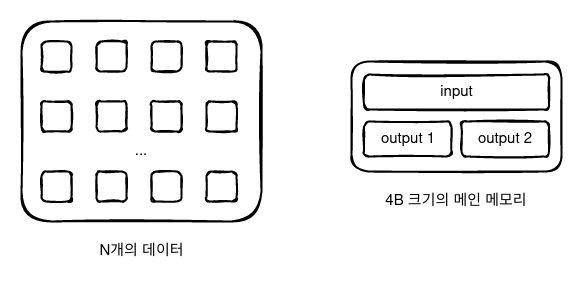

2. 디스크의 앞쪽과 뒤쪽에서 각각 $B$개의 데이터를 메인 메모리의 input 버퍼에 담는다.

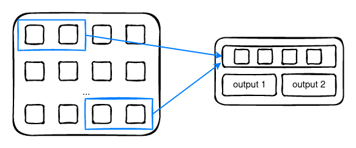

3. 여기서 피벗(pivot)을 잡아야 하는데, 적당히 첫번째 값으로 잡자.

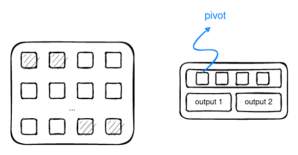

4. 이제 피벗 기준으로 작은 값은 **output 1** 버퍼에, 큰 값은 **output 2** 버퍼에 나눠서 담는다. 담는 도중 output 1 버퍼가 가득 찼다면 디스크의 앞쪽에 다시 채워넣고, output 2 버퍼가 가득 찼다면 디스크의 뒤쪽에 다시 채워넣는다.

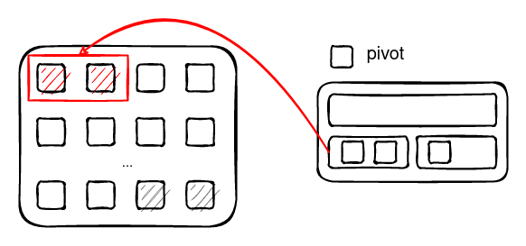

5. 그 후엔 다음 B개를 다시 디스크의 앞쪽과 뒤쪽에서 가져온다.

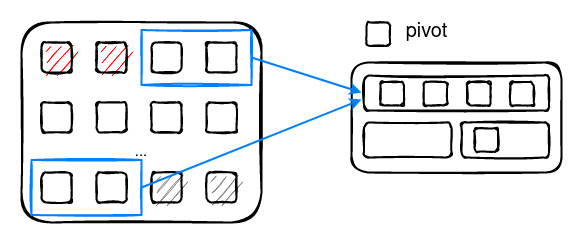

6. 마찬가지로 피벗을 기준으로 비교하여 output 버퍼에 담는다.

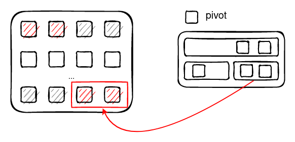

7. 퀵소트의 원리를 잘 알고 있다면 이 과정이 파티션 과정이라는 것을 파악했을 것이다. 이렇게 모든 데이터를 메인 메모리의 input 버퍼에 데이터를 올려 담아 output 버퍼로 파티션을 나누고 디스크에 기록하는 과정을 진행한다. 여기까지가 1번의 pass이며, pass가 끝나고 나면 디스크는 다음과 같은 모습일 것이다.

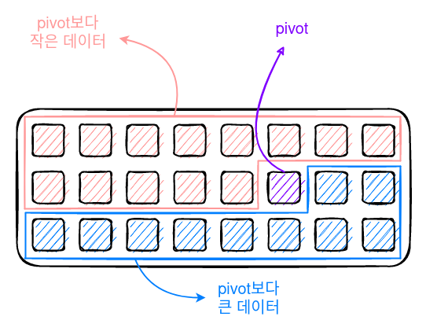

8. 이제 다시 `피벗보다 작은 데이터`와 `피벗보다 큰 데이터` 두 그룹에 대해서 위에서 진행한 과정을 그대로 다시 진행한다. 만약 그룹이 $4B$ 크기보다 작다면 모두 메인 메모리에 올려서 내부 정렬을 수행하면 된다.

## 시간복잡도 분석
pass의 평균적인 수를 계산해 보면 $1 + \log(\frac{N + 1}{4B})$라고 한다. 메인 메모리의 크기가 $4B$이므로 위에서 구한 머지소트 기반의 방법과 큰 차이가 없어 보인다.

하지만 어디까지나 평균이 그렇다는 얘기이다. 만약 파티션 과정에서 잡은 피벗이 전체 데이터 중 가장 작은 값(또는 가장 큰 값)이라고 생각해 보라. 퀵소트의 고질적인 문제점이 그대로 적용되어, 최악의 경우 전체 pass의 수는 $N$번이 될 것이다.

# 마치며...
"은총알은 없다"는 말이 있다. 어떤 상황이든 간에 상관 없이 항상 완벽하게 해결해 주는 방법은 없다는 뜻이다. 대부분의 경우 머지소트를 이용한 외부 정렬이 효율적이겠지만, 추가적인 디스크 공간이 없다면 머지소트는 포기하고 퀵소트 등의 다른 방법을 찾아야 할 것이다. 상황에 알맞게 어떤 방법을 쓸지 많이 고민해 보자.

# References
- 외부 정렬 설명 -- https://dudri63.github.io/2019/02/03/algo32/
- 외부 정렬 설명 2 -- https://twinparadox.tistory.com/194
- 외부 정렬 -- https://en.wikipedia.org/wiki/External_sorting
- external quicksort -- https://en.wikipedia.org/wiki/Quicksort#External_quicksort
- external quicksort 간단한 개요 -- https://xlinux.nist.gov/dads/HTML/externalQuicksort.html
- International Journal of Computer and Information Sciences, 1982 -- https://fdocuments.net/reader/full/an-efficient-external-sorting-with-minimal-space-requirement

 
 

---

<a id="fn-1">[\[1\]](#rfn-1)</a>: 물론 퀵소트의 시간복잡도는 최악의 경우 $O(n^2)$이다. 오름차순 혹은 내림차순으로 이미 정렬되어 있는 경우가 바로 그 경우인데, 정렬하기 전에 적당히 셔플을 해주면 우회 가능하다. [↩](#rfn-1)