# 탄생 비화
인터넷에서 검색을 하다 보면 좋든 싫든 검색 결과로 다양한 블로그들이 노출된다. 그 중에서 예쁘게 꾸민 블로그들을 볼 때마다 나도 **나만의 예쁜 블로그를 가지고 싶다**는 생각이 들었다. 그래서 처음엔 익숙한 플랫폼인 `네이버 블로그`로 시작을 했다. 관리하는 방법도 간단해서 몇 년 간 운영을 하다가, 점점 질리기 시작했다.

그 다음으로 눈을 돌린 곳은 `티스토리`였다. 티스토리는 html 태그를 직접 편집해서 네이버 블로그보다 자유롭게 커스텀이 가능하다는 장점이 있었다. 그렇게 티스토리로 이동하고 몇 달 간 블로그를 운영하다가 깨달았다. 나는 html 태그를 직접 편집해서 이쁘게 꾸미는 것을 잘 못한다는 사실을...


그렇게 티스토리도 뒤로 하고 다음으로 찾은 곳은 `깃허브 페이지`였다. 레포지토리를 이용해서 블로그처럼 사용하는 것이다. 깃허브 페이지의 경우 정적 웹 페이지만 가능하다는 단점이 있었지만 딱히 동적으로까지 뭔가를 하고 싶은 건 아니었기에 상관없었다. 근데 이것도 그리 오래 가진 못했다. 당시 무난한 NexT 테마를 사용했는데, 디자인은 깔끔해서 보기 좋았지만 점점 시간이 지날수록 이것도 질리기 시작했다(이쯤되면 그냥 쉽게 질리는 것 같다).

결국 깃허브 페이지도 버렸다. 그렇게 오랫동안 암흑기의 시간을 보내다가 다시 블로그를 시작하고 싶은 생각이 들었고, 이번에는 어느 플랫폼을 이용할까 하던 중 최근에 지인이 개츠비 블로그 테마를 개발<sup id="rfn-1">[\[1\]](#fn-1)</sup>하고 있다는 소식을 들었다. 그 사람의 블로그를 보니 Gatsby.js를 이용하여 구축하고, 이를 깃허브에 올리고, vercel을 이용해서 배포하고 있었다. 나는 그 블로그를 보고 테마가 너무 이뻐서 그대로 똑같이 블로그를 만들자고 생각이 들었다.

그렇게 이 블로그는 탄생했다.

# 저도 따라하고 싶어요
혹시나 따라하고 싶은 사람들을 위해 환경을 설정하는 방법에 대해 소개한다. 현재 나는 우분투에서 환경을 구축하고 visual studio code로 글을 작성하고 있으므로, 이 기준대로 설명하겠다.

1. 터미널을 켜고 다음을 입력한다.
    ```bash
    $ sudo apt-get update
    $ sudo apt-get install -y curl (curl이 없는 경우)
    $ curl -fsSL https://deb.nodesource.com/setup_current.x | sudo -E bash -
    $ sudo apt-get install -y nodejs
    ```
<br>

2. 그러고 나면 nodejs가 잘 설치됐을 것이다.
    ```bash
    $ node -v
    v16.8.0

    $ npm -v
    7.21.0
    ```
<br>

3. 이제 gatsby 블로그를 시작할 준비가 다 되었다. 다음을 입력한다.
    ```bash
    $ sudo apt-get install -y git (git이 없는 경우)
    $ npx -y gatsby new my-blog-starter https://github.com/blurfx/gatsby-starter-lavender
    ```
<br>

4. 뭔가 여러 가지 거슬리는 WARN, deprecated, vulnerabilities 등의 문구가 보일 테지만 일단은 무시하도록 하자. 커맨드가 정상적으로 수행됐다면 다음을 입력하여 블로그를 띄운다. localhost:8000에 접속하면 샘플 상태의 블로그가 보일 것이다.
    ```bash
    $ cd my-blog-starter/
    $ npm install -g yarn (yarn이 없는 경우)
    $ yarn dev
    ```
<br>

5. 이제 다른 사람도 볼 수 있게 배포를 해 보자. 배포하는 방법은 vercel, netlify, gatsby cloud 등 여러 방법이 있지만 여기선 vercel을 기준으로 설명한다. 이 [링크](https://vercel.com/new/git/external?repository-url=https%3A%2F%2Fgithub.com%2Fblurfx%2Fgatsby-starter-lavender)를 눌러 배포 준비를 한다.
<br>

6. 그러면 다음과 같은 화면이 보일 것이다. **Continue with GitHub**를 눌러 진행한다.
    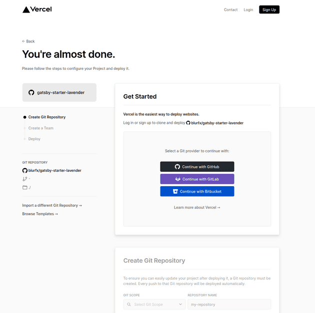
<br>

7. gatsby 블로그를 위한 리포지토리를 생성한다. **GitHub**를 선택한다.
    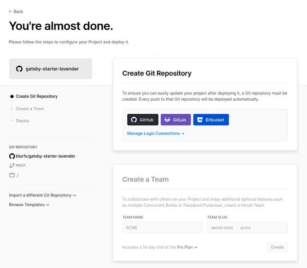
    <br>

    적당히 입력한 후 **Create** 버튼을 누른다. 이때, public으로 생성하고 싶다면 좌측 하단의 체크박스를 해제한다.
    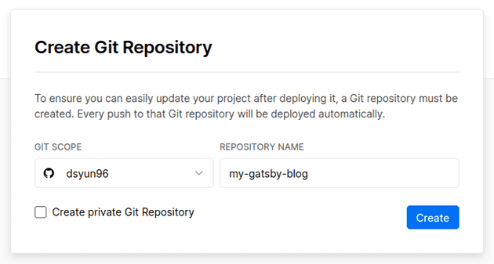
    <br>

    잘 생성되었다. 깃허브에 가서 자신의 리포지토리 목록을 확인해보면 실제로 생성된 것을 확인할 수 있다.
    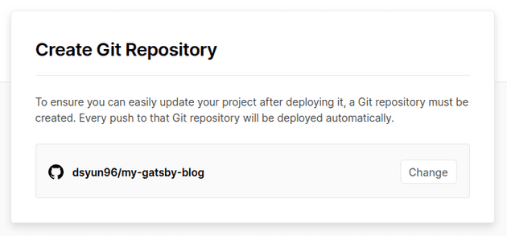
<br>

8. 이후 다음 설정으로 넘어가는데, 딱히 팀을 만들 필요는 없으므로 **Skip**을 선택한다.
    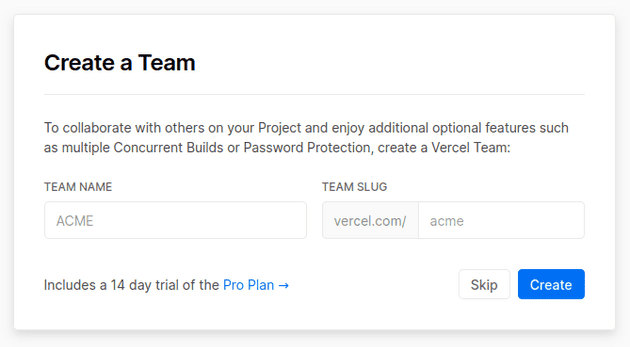
<br>

9. 그러고 나면 이제 클론 및 배포가 진행된다. 약간의 시간이 걸리므로 인내를 가지고 기다리다 보면 배포가 완료된다.
    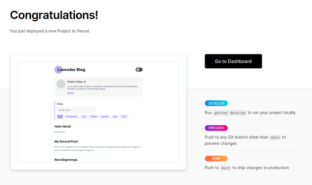
<br>

10. 처음에 리포지토리 이름을 `my-gatsby-blog`라고 했으므로 이를 기반으로 사이트 이름이 정해진다. 참고로 이미 누가 선점한 이름인 경우 뒤에 적당히 문자열이 붙는 모양이다.
    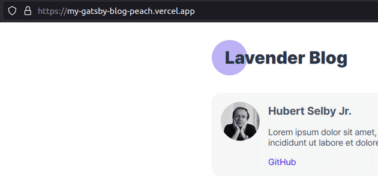
    <br>

    이름을 바꾸고 싶다면 vercel 사이트의 dashboard로 가서 방금 생성된 프로젝트를 선택한다.
    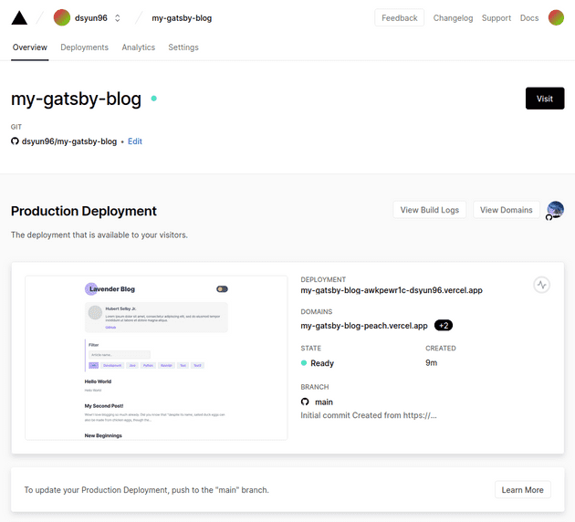
    <br>

    좌측 상단의 **Settings**를 선택한다.
    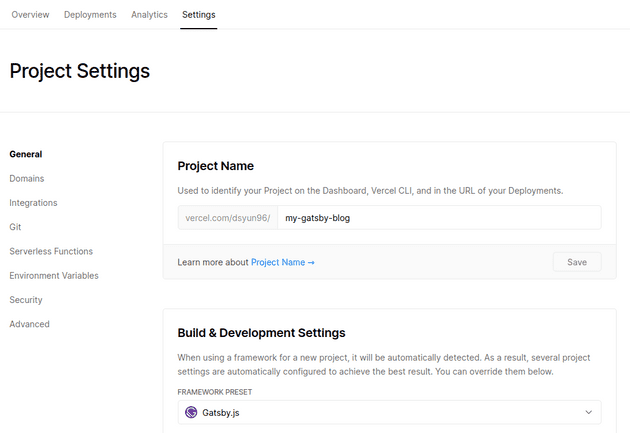
    <br>

    좌측 메뉴의 **Domains**를 선택한다. 이후 **Edit** 버튼을 누른다.
    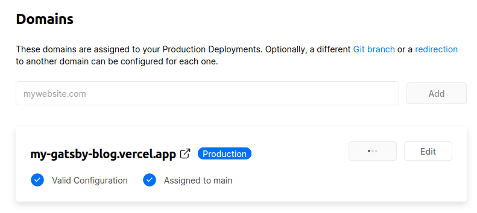
    <br>

    원하는 이름으로 바꾸고 **Save** 버튼을 누른다.
    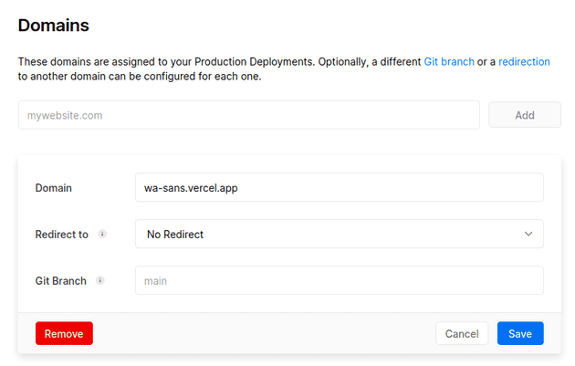
    <br>

    이제 잘 되는 것을 확인할 수 있다.
    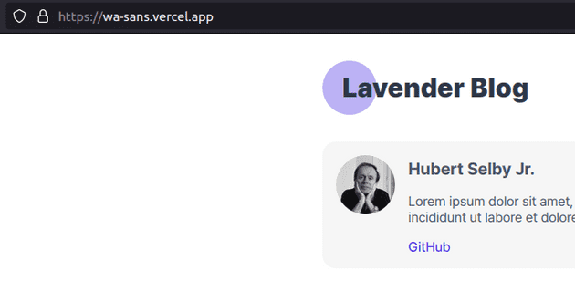
<br>

11. 이제 깃허브에 가서 gatsby 블로그 용도로 만든 리포지토리를 클론하고 행복하게 블로깅을 즐기면 된다.

# 댓글 기능에 대해
참고로 댓글 기능은 `utterances`와 `disqus`를 지원한다. utterances 기능을 이용해 댓글을 작성하려면 깃허브를 통해 로그인을 해야 한다.

**로그인 전**
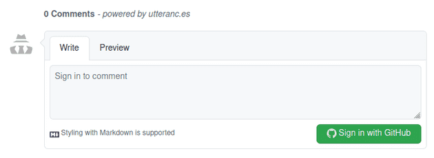
<br>

**로그인 후**
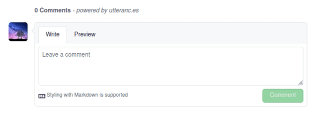

그리고 최초 블로그를 시작했을 때 utterances 설정을 해줘야 한다. 댓글을 처음으로 작성하려고 하면 다음과 같이 오류가 뜨는 것을 볼 수 있을 것이다.
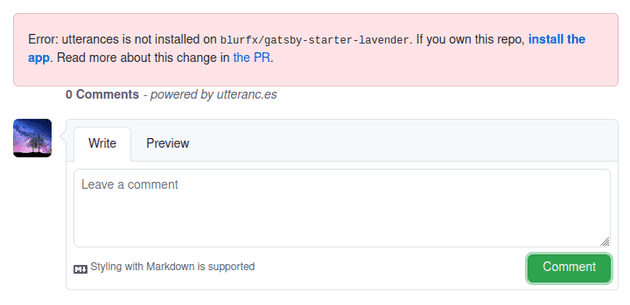

## 해결 방법
1. 먼저, `blog-config.ts` 파일의 설정을 바꿔줘야 한다. siteUrl을 자신의 블로그 주소, comment의 utterances 부분을 자신의 리포지토리로 바꾸고 커밋, 푸쉬한다. 푸쉬하고 나면 알아서 deploy가 진행되므로, 완료되는 동안 다음 설정을 하자.
    ```
    const config = {
        ...
        siteUrl: 'https://wa-sans.vercel.app/',
        ...
        comment: {
            utterances: 'dsyun96/my-gatsby-blog', // Your GitHub repository
            disqusShortName: '',  // Disqus short name
        },
        ...
    };

    export default config;
    ```
<br>

2. 그리고 아까 위에서 본 화면에서 **install the app** 버튼을 누르면 다음과 같은 화면이 나올 것이다. 여기서 **Configure** 버튼을 누른다.
    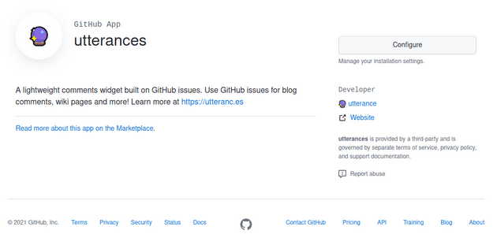
<br>

3. gatsby 블로그 용도로 만든 리포지토리를 검색해서 선택하고 **Save** 버튼을 누른다.
    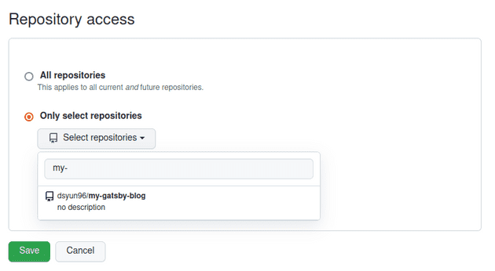
<br>

4. 빌드가 완료되면 이제 정상적으로 댓글이 잘 달리는 것을 확인할 수 있다.
    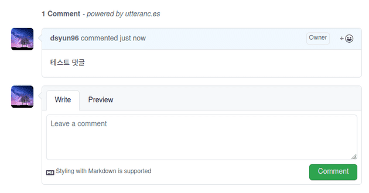
    <br>

    참고로 블로그에 댓글을 작성하면 리포지토리의 Issues에 자동으로 생성되어 해당 이슈에 댓글이 달리는 방식이다.
    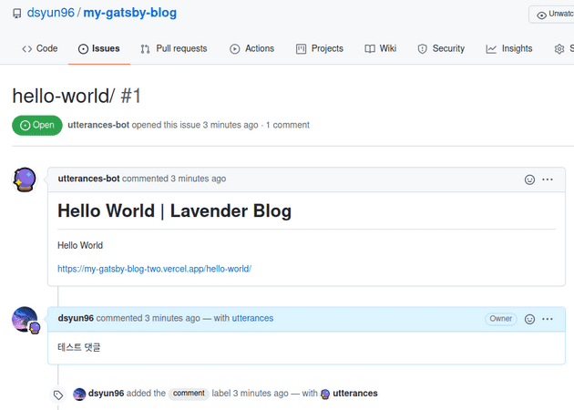

# 진짜 끝!
블로그를 설정하기 위한 기나긴 여정이 끝났다. 긴 글을 읽어주신 분들에게 감사를 표하며, 글을 마치려고 한다.


---

<a id="fn-1">[\[1\]](#rfn-1)</a>: 리포지토리 주소 -- https://github.com/blurfx/gatsby-starter-lavender [↩](#rfn-1)